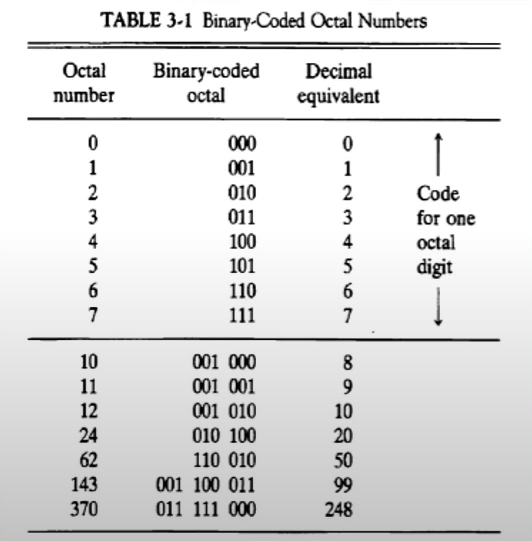
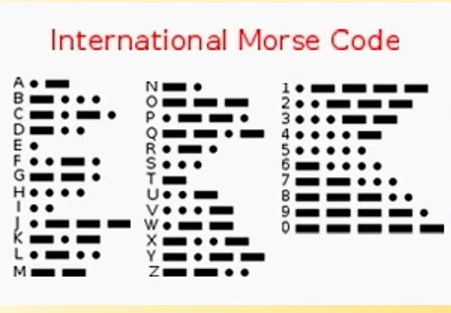

## [제 3장 Part-1](https://www.youtube.com/watch?v=aSocCv3SC2k&list=PLc8fQ-m7b1hCHTT7VH2oo0Ng7Et096dYc&index=6)

### 데이터의 종류 (Data Types)

#### 컴퓨터 레지스터에서 쓰이는 데이터 종류

- 산술 연산용 숫자 (Numeric)
- 데이터 처리용 영문자 (Alpha) ,52자 
- 특수 목적용 기호(Special), 

#### 진수와 진법

**radix : 진법의 기수에 해당 (10, 2, 8, 16)**

- 10진수
  - 724.5 = 7x10^2 + 2x10^1 + 4x10^0 + 5x10^-1
- 2진수
  - 101101  = 1x2^5 0x2^4 + 1x2^3 + 1x2^2 + 0x2^1 + 1x2^0 = 45
- 8진수
  - 736.4 = 7x8^2 + 3x8^1 + 6x8^0 + 4x8^-1 = 478.5
- 16진수
  - F3 = Fx16^1 + 3x16^0 = 243

- 2진화 8진수 (Octal)

- 2진화 16진수 (Hexadecimal)

- 2진화 10진수 (BCD : Binary Code Decimal)

#### 영숫자(AlphaNumeric)의 표시

- ASCII(American Standard Code) Code : 7bits(+1 parity bit),
- EBCDIC Code : 16bits, IMB internal code
- UniCode : 16bits/32bits

#### Special Communication Data

- Morse code

- Flag Signal(Red/White flags)

### 보수 (Complements)

#### 정의

- 진법의 기수 ra대응하는 역(reverse) 값
- 뺄셈과 논리 계산에 사용

#### (r-1)의 보수 체계

- 9's complement 9999 - 12389 = 87610
- 1's complement 1111111 - 0001111 = 1110000

#### (r)의 보수 체계 

- 10's complement 100000 - 12389 = 87611
- 2's complement = 10000000 - 0001111 = 1110001

#### 부호 없는 숫자의 뺄셈

- 72532 - 13250 = 59282

- 13250-72532 = -40728

- 부호없는 2진수의 뺄셈

## [제 3장 Part-2](https://www.youtube.com/watch?v=bysGzutpRgc&list=PLc8fQ-m7b1hCHTT7VH2oo0Ng7Et096dYc&index=7)

### 고정 소수점 표현 (Fixed Point Representation)

- 

### 부동 소수점 표현 (Floating Point Representation)

- 

### 기타 이진 코드 (Other Binary Codes)

- 

### 에러 검출 코드 (Error Detection Codes)

-