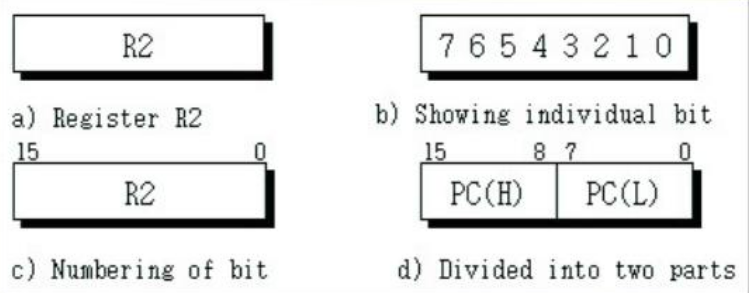
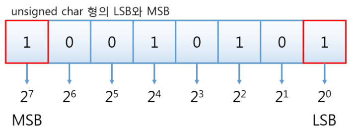

## 레지스터의 전송

#### 1. 마이크로 연산

​	: 레지스터에 저장된 데이터를 가지고 실행되는 기본적인 연산을 마이크로 연산이라고 한다. 마이크로 연산은 하나의 클럭 펄스 동안 실행되는 기본적인 동작으로는 시프트(Shift), 카운트(Count), 클리어(Clear), 로드(Load) 등이 있다. 마이크로 연산은 **레지스터 전송 마이크로 연산**, 산술 마이크로 연산, 논리 마이크로 연산, 시프트 마이크로 연산 등으로 분류할 수 있다. 해당 문서에서는 레지스터 전송에 대해서 다룰 것이다. 

#### 2. 레지스터 전송 언어(Register Transfer Language)

​	: 마이크로 연산, 전송을 간단하고 명료하게 표시하기 위해 사용하는 기호이다. 디지털 시스템의 설계 편의성을 제공하기 위해 디지털 컴퓨터의 내부 조직의 내용을 상세하게 나타내는 수단으로 사용한다.

​	디지털 컴퓨터의 하나의 기능을 위한 일련의 마이크로 연산들을 묘사하기 위해 사용된다. 

(1) 기본 기호

(2) 대문자로 표시한다. 

- 레지스터의 종류 : MAR, MBR, AC, PC, DR 등

  

(3) 레지스터 블록도 표현

- a ) R2 : Processor Register #2
- b ) 레지스터 안의 각각의 비트를 표현
- c ) 하나의 레지스터에서 표현할 수 있는 비트의 개수를 알려준다.
- d ) 레지스터를 두 파트로 나누는 것을 표현하는 방법 , PC(15-8), PC(0-7) 로 표현하기도 한다.

(4) 레지스터 가장 왼쪽 비트를 MSB(Most Significant Bit), 레지스터 가장 오른쪽 비트를 LSB(Least Significant Bit)

[MSB, LSB에 대해 더 궁금하다면..?](https://blog.naver.com/ansdbtls4067/220886567257)

(5) 레지스터 정보 전송

- 치환(Replace) 연산자를 이용하여 표현

  - R2 ← R1 :  R1 에서 R2로 정보를 전송

    

- 정해진 제어 조건이 만족할 경우의 레지스터의 전송 표현

  -  if (p=1) then (R2←R1) : 만약 (p=1)의 조건이 만족되면  R1 에서 R2로 정보를 전송

    

- 제어함수(Control Function) 

  - 정해진 조건이 만족할 때에 원하는 동작이 수행되도록 제어가 필요한 함수 표현.
  - 제어신호가 1일 때에 원하는 동작이 수행된다.
  - P: R2 ←R1 =
    - 만약 P가 1일 때  R1 에서 R2로 정보를 전송한다.

- 동시 연산(Simultaneous Operations)

  - 하나의 제어 함수에 두 개 이상의 연산이 동시에 수행되는 경우, 콤마(,)로 분리하여 마이크로 연산을 나열하여 표현한다. 
  -  P: R2 ← R1, MAR ← IR 
    - 만약 P가 1일 때  R1 에서 R2로 정보를 전송한다. 그리고 그 때(same clock에) 레지스터 IR 의 내용을 레지스터 MAR에 로드해라.

- 메모리 전송

  메모리 워드로부터 외부 세계로의 정보 전송은 읽기(read) 동작을 통해서 이루어지고, 메모리로 새로운 정보를 저장하는 것은 쓰기(write)동작에 의해 이루어진다. 메모리 워드는 M으로 나타내며, 주소는 M 다음의 각괄호 안에 표시한다. 메모리 주소를 주소 레지스터(address register, AR)로부터 받고 데이터를 데이터 레지스터 (data register, DR)에 전송하는 읽기 동작을 기호로 나타내면 다음과 같다.

  Read : DR ← M[AR]

  레지스터 R1에 있는 데이터를 AR에서 지정된 메모리 주소로 전송하는 쓰기 동작은 다음과 같이 나타낼 수 있다.

  Write: M[AR] ← R1