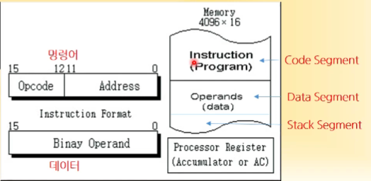
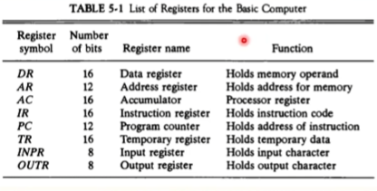
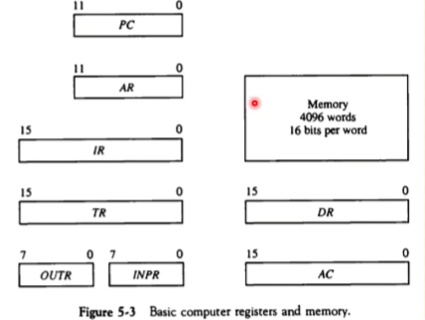
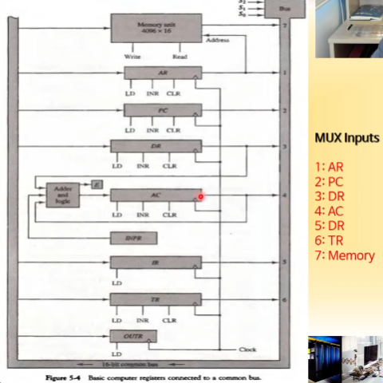

## [제 5장 Part-1-1](https://www.youtube.com/watch?v=vSnpYzCuwVY&list=PLc8fQ-m7b1hCHTT7VH2oo0Ng7Et096dYc&index=10)

컴퓨터란 곧 CPU다! 나머지는 주변장치일 뿐..

### 명령어 코드 (Instruction Codes)

컴퓨터는 기본적으로 튜링머신임! 

튜링머신 : 프로그램을 컴퓨터의 기억장치에 저장한 후, 프로그램의 명령어를 하나하나 꺼내와서 실행시키는 것

- 컴퓨터의 동작

  - 레지스터 내에 저장된 데이터에 대한 마이크로 연산의 시퀀스에 의하여 정의
  - 범용 컴퓨터 시스템에서는 다양한 마이크로 연산 시퀀스를 정의

- 명령어 코드

  - 컴퓨터에게 어떤 특별한 동작을 수행할 것을 알리는 비트들의 집합 (빼라 더해라 전송해라 저장해라.. 등등등)
  - 연산 코드들로 구성

- 컴퓨터 명령어

  - 컴퓨터에 대한 **일련의** **마이크로 연산**을 기술 (연산들을 모아서 명령어라고 한다! == 기계어 프로그램! == 명령어 시퀀스)
  - 이진 코드로 구성
  - 데이터와 함께 메모리에 저장

- 프로그램 (**기계어 프로그램**을 의미함! 고급언어 아님!)

  - 사용자가 원하는 연산과 피연산자가 처리되는 순서를 기술한 **컴퓨터 명령어의 집합**
  - 명령어 처리 과정을 제어

- 내장 프로그램 (메인메모리나 레지스터에 들어가 있는 명령어들의 집합)

  - 제어 신호에 의하여 명령어의 이진 코드를 해석하여 실행
  - 명령어를 저장하여 실행하는 컴퓨터 구동 방식

- **저장(내장) 프로그램 구조**

  - 명령어의 집합으로 구성
  - 각 명령어는 명령어 포맷에 따라서 정의
  - 프로그램 실행 부분에 따라서 메모리의 다른 부분(segment)에 저장
  - 명령어 실행 결과는 AC에 저장

  

​											Opcode(3) : 기계 명령어(더해라, 데이터를 가져와라 ... ...)

​											Address(12) : 데이터의 주소값

​														 I(1) : 주소값이 직접 주소인지 간접 주소인지 구별하는 비트

이런 Opcode들의 집합이 프로그램이다! 프로그램은 튜링머신이기 때문에 메인메모리에 저장된다.

그림에서 메인메모리의 용량은 4K. 명령어도 16bit, 데이터도 16bit이기 때문에 한 공간을 16bit로 나눠놓았다. 즉 address가 4096개 존재 -> 왜 하필 기본 컴퓨터는 4K인가?

=> address가 12bit -> address가 가질 수 있는 최대 주소 값 = 2^12 = 4096. 때문에 4K!!

 

메인메모리는 명령어가 저장되는 부분과 데이터가 저장되는 부분(Segment)가 나눠져있다! 

이것 이외에도 임시로 쓰는 데이터들을 위해 별도의 공간을 확보해두는데, Stack Segment 또는 Heap이라고 부른다.

=> 하나의 프로그램이 메인메모리에 들어가서 실행될 때, 최대 3개의 세그먼트(Code, Data, Stack)로 구성된 메모리 공간을 차지한다!

=> CPU에서 프로그램이 돌아가려면 명령어, 데이터, 이들이 저장되는 메모리가 있어야 하고, 연산을 했을 때 연산의 결과를 집어넣는 AC가 필요하다! Opcode를 실행하고 나면 그 결과를 AC에 집어넣는 동작을 계속해서 반복하면서 컴퓨터가 동작하는 것!

- **간접 주소(Indirect Address) 시스템**

  > I 비트가 0이면 직접주소, 1이면 간접주소! -> 간접주소일 경우, 주소에 써있는 값이 주소이고, 그 주소로 다시 가봐야함, 그 곳에 있는 값이 데이터!

  - 많은 경우, 직접주소를 사용하여 데이터 지정
  - 필요한 경우, 간접주소로 데이터 지정

   

  간접주소를 왜 사용함? 

  -> 간접주소를 사용하지 않으면 안되는 컴퓨터의 제어구조들이 여러개 존재함. 또 프로그래밍 언어 입장에서도 필요하기도 한다.

### 컴퓨터 레지스터 (Computer Registers)

- 기본 컴퓨터의 레지스터

  - 기본 컴퓨터란?

    - DEC PDP-11 Mini Computer
    - 가상의 컴퓨터가 아닌 **실제 제품**
    - 1980년대 주력 메인 프레임 급
    - 최신의 CPU도 동일한 구조

  - 기본 컴퓨터 레지스터 종류

    

    

- 버스 시스템의 종류

  - 내부 버스 : CPU(컴퓨터) 내부 레지스터간 연결
  - 외부 버스 : CPU 내부 레지스터 - 메모리간 연결
  - 입출력 버스 : CPU <-> 주변장치(I/O) 연결

- 공통 버스 시스템 (= 내부 버스)

  - 내부 버스를 통칭
  - 내부 버스의 크기(Width)로 CPU 워드 크기 결정
    - 16bit 컴퓨터 - 내부 버스 / 레지스터 크기가 16bit
    - 32bit 컴퓨터 - 내부 버스 / 레지스터 크기가 32bit

  - 전송 연결 통로
    - 레지스터 - 레지스터 데이터 전송 통로
    - 레지스터 - 메모리 데이터 전송 통로(예외적 표현!)
    - **한 순간에는 하나의 전송 신호만**이 버스에 존재 가능
      - 2개 이상의 신호 발생시에는 **버스 충돌** 발생
      - 버스 제어기 (정확한 타이밍과 MUX 제어 수행)

  

  병렬 로드가 가능한 양방향 shift 레지스터

  - 레지스터 출력은 버스의 MUX 입력에 연결
  - 각 레지스터 MUX 입력번호 설정됨
  - 레지스터 입력은 버스에 직접 연결(LD로 제어)
  - S2, S1, S0에 의하여 레지스터 출력 결정

- 버스의 동작

  DR <- AC, AC <- DR

  M[AR] <- DR

  AR <- PC

## [제 5장 Part-1-2](https://www.youtube.com/watch?v=T2oKxvinK84&list=PLc8fQ-m7b1hCHTT7VH2oo0Ng7Et096dYc&index=11)

### 컴퓨터 명령어 (Computer Instructions)

- 

### 타이밍과 제어 (Timing and Control)

- 

### 명령어 사이클 (Instruction Cycle)

- 

### 메모리 참조 명령어 (Memory-Reference Instuctions)

-
