## [제 8장 Part-1](https://www.youtube.com/watch?v=-Y2-gdesND8&list=PLc8fQ-m7b1hCHTT7VH2oo0Ng7Et096dYc&index=18)

### CPU 주요 요소

##### 기억장치

- 레지스터 집합
- 데이터 임시 저장 장소

##### 제어장치

- CPU 명령어 처리 회로의 집합
- 논리 게이트와 요소들로 구성
- 명령어에 따라서 연산 제어 수행

##### 연산장치

- ALU
- 산술 연산, 논리 연산 및 시프트 연산 수행

##### 제어장치

- CPU 명령어 처리 회로의 집합

### 범용 레지스터 구조 ( General Register Organization)

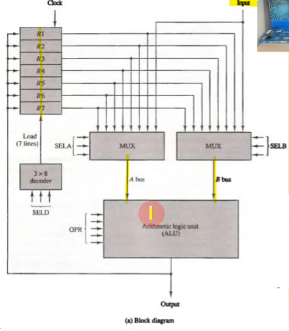

##### 공용 ALU를 가진 레지스터 집합

- 7개의 범용 레지스터
- 3 X 8 디코더 1개
- 8 X 1 MUX 2개
- ALU

##### 제어 워드 집합

- SELA, SELB : ALU 입력 결정

- SELD : ALU 출력 저장소 결정

- OPR : 연산의 종류 지정

  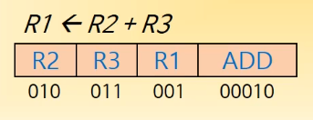

  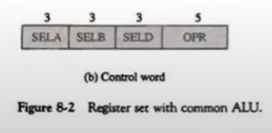

##### 레지스터와 연산 인코딩

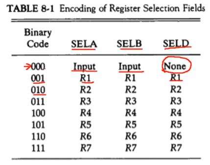

##### 마이크로 연산의 예

- R1 <- R2 - R3

  

  

### 스택 구조 (Stack Organization)

##### 레지스터 스택

- PUSH 동작

  - SP <- SP + 1

    M[SP] <- DR

    If (SP = 0) then (FULL <- 1)

    EMPTY <- 0

    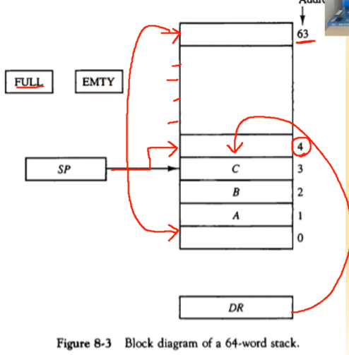

- POP 동작

  - DR <- M[SP]

    SP <- SP - 1

    If (SP = 0) then (EMPTY <- 1)

    FULL <- 0

    

##### 메모리 스택

- PUSH 동작

  - SP <- SP - 1

    M[SP] <- DR

- POP 동작

  - DR <- M[SP]

    SP <- SP + 1

##### 메모리 세그먼트

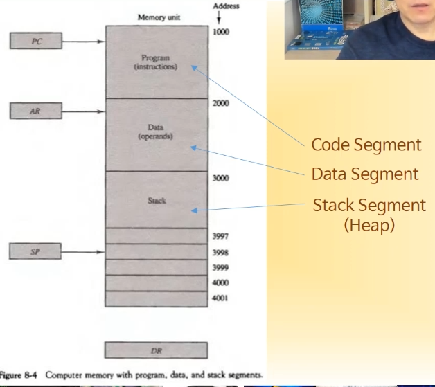

- Code/Data/Stack(Heap)
- 세그먼트의 크기
  - MS-DOS/Windows : 64KB
  - UNIX / Linux : N x 1KB 블록
- 스택 오버플로우
  - 스택의 크기를 벗어나는 SP 값
  - Protected mode에서 발생

##### 연산자 표기 방식

- Infix :  A + B
- Prefix (polish) : + A B
- Postfix (reverse polish) : A B +

##### 역 polish 표기

- A * B + C * D -> AB * CD * +

##### 스택 기반의 산술식 계산

- (3 * 4) + (5 * 6) -> 34 * 56 * +

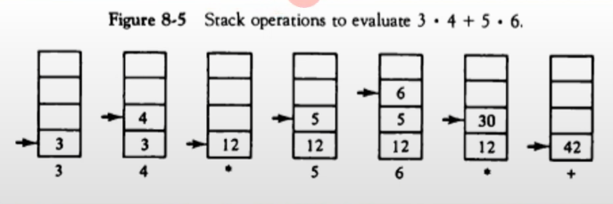

## [제 8장 Part-2](https://www.youtube.com/watch?v=uQrRlccgSs4&list=PLc8fQ-m7b1hCHTT7VH2oo0Ng7Et096dYc&index=19)

### 명령어 형식 (Instruction Format)

##### 단일 누산기 구조

모든 연산이 누산기를 중심으로 실행된다!

- ADD X

  AC <- AC + M[X]

##### 범용 레지스터 구조

- ADD R1, R2, R3     : R1 <- R2 + R3
- ADD R1, R2            : R1 <- R1 + R2
- MOV R1, R2            : R1 <- R2
- ADD R1, X               : R1 <- R1 + M[X]

##### 스택 구조

- PUSH X
- ADD

만약 X = (A + B) * (C + D) 의 명령어를 수행할때

- 3주소 명령어

  

- 2주소 명령어

  

- 1주소 명령어

  

- 무주소 명령어

  

- RISC 명령어

  연산할 경우 무조건 레지스터를 끼리만 하는게 특징!!

  

### 어드레싱 모드 (Addressing Mode)

##### 다양한 어드레싱 모드이 사용 이유

- Pointer, counter, indexing 기능 제공
- 프로그램 재배치(relocation) 편의 제공 -> 프로그래밍의 융통성 제공
- 명령어 주소 필드 최소화

##### 명령어 형식 with mode field

##### Implied 모두

- 피연산자가 묵시적으로 정의
- AC, E도는 스택에 피연산자 위치

##### Immediate 모드

- 피연산자가 명령어 자체에 있음
- 상수를 레지스터에 초기값으로 주는 경우 사용

##### 레지스터 (직접)모드

- CPU내 레지스터에 피연산자 존재

##### 레지스터 간접 모드

- 명령어가 피연산자 주소를 가지고 있는 레지스터를 지정
- 직접 주소보다 적은 어드레스 비트 사용

##### 자동 증가 / 자동 감소 모드

- 메모리 접근 후, 레지스터 값이 자동으로 증가 / 감소

##### 직접 주소 모드

- 명령어의 주소부분이 유효주소(EA)를 표시
- 분기 명령에서는 실제 분기 주소 표시

##### 간접 주소 모드

- 명령어 주소 부분에 유효주소를 지정하는 주소 표시
- 다양한 간접주소 모드 사용
- 유효주소의 계산 : 유효주소(EA) = 명령어 주소 부분(ADDR) + CPU 내 특정 레지스터 값

##### 상대 주소 모드

- 유효 주소 = 주소 필드값과 프로그램 카운터 값의 합 (EA = ADDR + PC)

##### 인덱스 어드레싱 모드

- 유효 주소 = 주소 필드값과 인덱스 레지스터값의 합 (EA = ADDR + XR)
- 배열(Array)의 각 원소에 대한 인덱스 주소 계산에 사용

##### 베이스 레지스터 어드레싱 몯,

- 유효주소 = 주소 필드 값과 베이스 레지스터 값의 합 (EA = ADDR + BR)
- Protected 모드의 메모리에서 세그먼트 주소 인덱싱에 사용

##### 어드레싱 모드의 실제 예

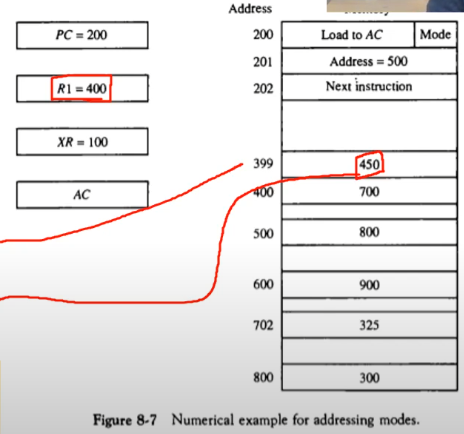

### 데이터 전송과 처리 (Data Transfer and Manipulation)

##### 데이터 전송 명령어와 주소 모드

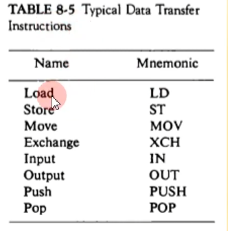

##### 데이터 처리 명령어

- 산술 명령어 

  

- 논리 연산 및 비트 처리 명령어

  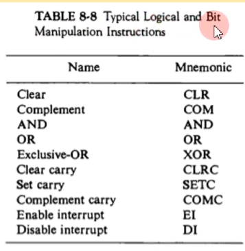

- 시프트 명령어

  

### 프로그램 제어 (Program Control)

##### 상태 비트 조건

- C : ALU 출력 캐리값
- S : AC의 부호 비트
- Z : AC 값의 zero 여부
- V : 연산 결과 오버플로우 여부

##### 상태 비트의 예

A = 1111 0000 B = 00010100 이면,

A - B : 1101 1100 이다. (C = 1, S = 1, V = 0, Z = 0)

##### 조건부 분기 명령어

- 상태 비트에 따라서 분기한다.
  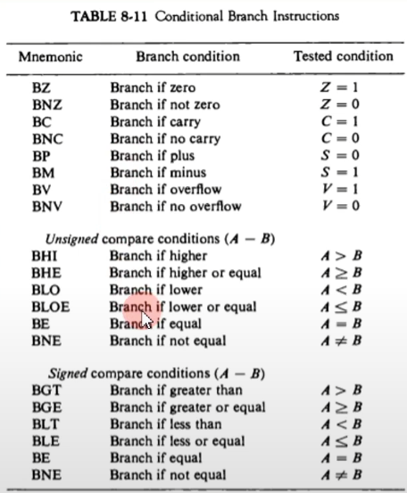

##### 서브루틴 Call

##### Return

##### 순환 서브루틴(Recursive Subroutine)

- 서브루틴이 자기 자신을 호출
- 순환 Call이 return 주소를 지워버리는 것을 방지하기 위하여 스택에 return 주소를 저장

##### 프로그램 인터럽트

- 서브루틴과의 차이점
  - 시스템 내, 외부적 신호에 의하여 프로그램 진행 변경
  - 인터럽트 처리 루틴의 주소는 하드웨어적으로 결정되어 있음
  - PC 값만이 아니라 CPU의 다른 상태를 나타내는 정보도 대피(메모리에 저장)
- PSW (Program Status Word)
  - 인터럽트가 발생될 때 저장하는 CPU 정보
  - PSW로 저장되는 데이터
    - 프로그램 카운터(PC)의 값
    - 모든 레지스터의 값
    - 상태 조건 비트(C, S V, Z)

##### 인터럽트의 형태

- 외부 인터럽트
  - 입출력 장치, 타이밍 장치, 전원 등 외부 요소에 의하여 발생
- 내부 인터럽트
  - 불법적인 명령이나 데이터를 사용할 때 방생
  - 오버플로우, divided by 0, segment fault 등
- 소프트웨어 인터럽트
  - 명령어의 수행에 의하여 발생
  - Supervisor call 명령, system call

### 간소화된 명령어 집합 컴퓨터 (RISC)

##### RISC (Reduced Instruction Set Computer) 개요

- 1980년 UC Berkeley David. A. Patterson 교수가 설계
- CISC (Complex Instruction Set Computer)에 비하여 새로운 설계 개념 제시
- 새로운 마이크로 아키텍쳐와 명령어 구조 제시
- MIPS, ALPHA, PowerPC, SPARC, PA-RISC

##### CISC vs RISC

- CISC
  - 많은 수의 명령어
  - 특별한 명령을 수행하는 일부 명령어는 자주 사용되지 않음
  - 다양한 어드레싱 모드 사용
  - 가변 길이 명령어 형식
  - 메모리에서 피연산자 처리
- RISC
  - 상대적으로 적은 수의 명령어
  - 상대적으로 적은 수의 어드레싱 모드
  - 메모리 참조는 load/store 명령으로만 제한
  - 모든 동작은 CPU내 레지스터에서 수행
  - 고정된 길이의 명령어 형식 사용
  - 단일 사이클의 명령어 실행
  - 하드와이어 제어방식 사용

##### RISC 프로세서의 특징

- 적은 수의 명령어로 인한 장점
  - 제어장치의 간소화로 여유공간 확보
  - 많은 수의 레지스터(128개 이상)
  - 제어장치를 하드와이어 방식으로 구현
- 효과적인 명령어 파이프라인 사용
- 프로시저의 빠른 호출/복귀를 위한 중첩된 레지스터 윈도우 사용
- 빠르고 효과적인 구조의 컴파일러
- 고정 길이 명령어 사용으로 간단한 디코딩
- 단일 사이클의 명령어 실행

##### 중첩된 레이스터 윈도우

- 프로시저에 사용할 파라미터 전달
- 중첩된 윈도우를 통하여 보호모드에서 빠른 데이터 전달
- 많은 수의 레지스터로 인한 구조적 장점

##### Berkeley RISC I 명령어 구조

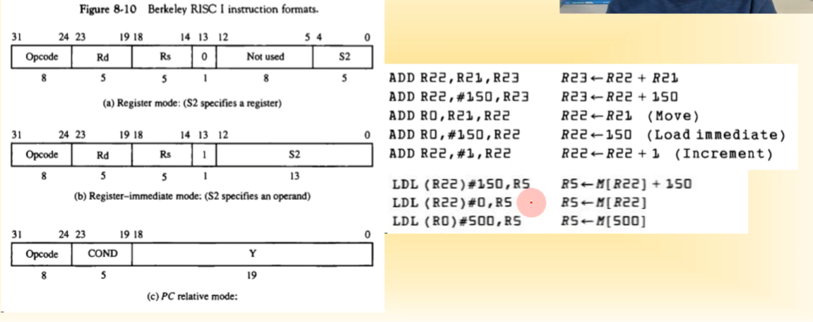